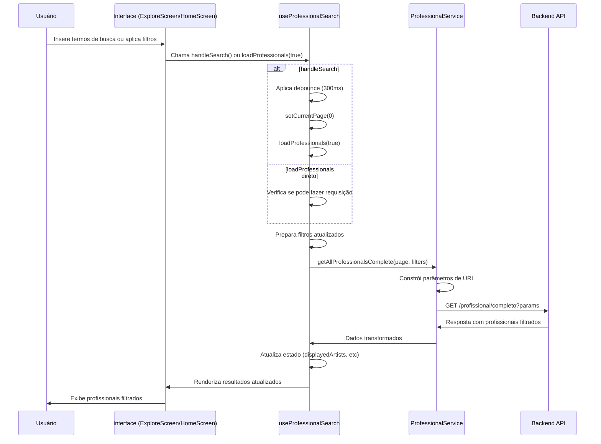
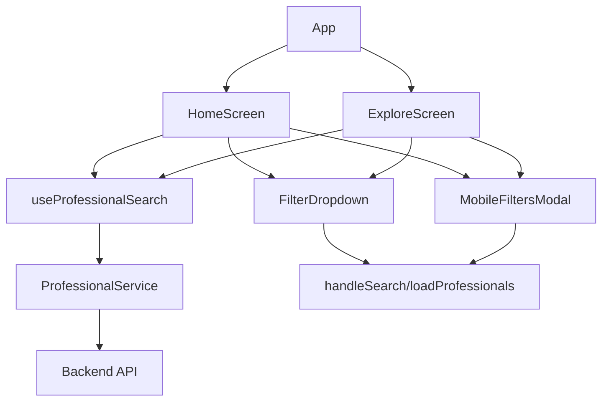
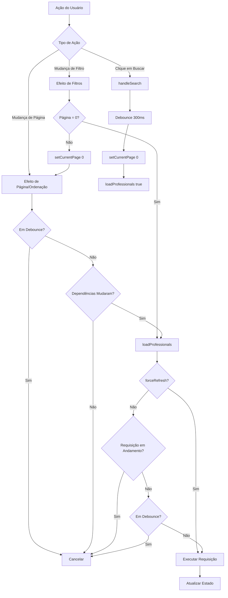
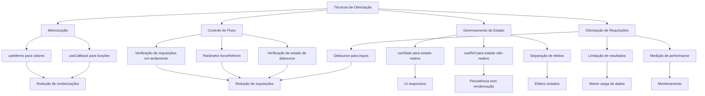

# Documentação de Correções dos Filtros de Busca - Inkspiration

## Sumário
1. [Introdução](#introdução)
2. [Problema Identificado](#problema-identificado)
3. [Solução Implementada](#solução-implementada)
   - [Hook useProfessionalSearch](#hook-useprofessionalsearch)
   - [Serviço ProfessionalService](#serviço-professionalservice)
   - [Componentes de Interface](#componentes-de-interface)
4. [Fluxo de Dados](#fluxo-de-dados)
5. [Detalhes de Implementação](#detalhes-de-implementação)
6. [Testes e Validação](#testes-e-validação)
7. [Conclusão](#conclusão)

## Introdução

Este documento detalha as correções implementadas no sistema de busca e filtragem de profissionais no aplicativo Inkspiration. As correções visam resolver problemas relacionados à aplicação de filtros, especialmente quando o usuário utiliza os botões de busca ou aplica filtros através dos componentes da interface.

O Inkspiration é um aplicativo que permite aos usuários encontrar profissionais de tatuagem com base em diversos critérios de busca, como localização, avaliação e especialidades. A funcionalidade de busca é central para a experiência do usuário e precisa funcionar corretamente para garantir resultados precisos.

## Problema Identificado

Foram identificados os seguintes problemas no sistema de busca:

1. **Valores desatualizados dos filtros**: A função `loadProfessionals` não estava capturando os valores mais recentes dos filtros aplicados pelo usuário.

2. **Problemas com o parâmetro `selectedSpecialties`**: O backend espera que este parâmetro seja enviado como múltiplos parâmetros com o mesmo nome, ou seja, como um array de valores, mas o frontend não estava tratando corretamente quando o array estava vazio.

3. **Falta de atualização forçada**: Quando o usuário clicava no botão de busca ou aplicava filtros, a função de busca não era forçada a executar se já houvesse uma requisição em andamento ou se estivesse em debounce.

## Solução Implementada

### Hook useProfessionalSearch

O hook personalizado `useProfessionalSearch` foi modificado para resolver os problemas identificados. As principais alterações foram:

#### 1. Adição do parâmetro `forceRefresh`

```javascript
// Função principal para carregar profissionais
const loadProfessionals = useCallback(async (forceRefresh = false) => {
  // Se já houver uma requisição em andamento e não for uma atualização forçada, não fazer nada
  if (isRequestInProgress.current && !forceRefresh) {
    return;
  }
  
  // Se estivermos no meio de um debounce e não for uma atualização forçada, não fazer nada
  if (isDebouncing.current && !forceRefresh) {
    return;
  }
  
  try {
    isRequestInProgress.current = true;
    setIsLoading(true);
    const startTime = performance.now();
    
    // Preparar os filtros para o formato que o backend espera
    const currentFilters = {
      searchTerm: searchTerm.trim() || null,
      locationTerm: locationTerm.trim() || null,
      minRating,
      selectedSpecialties: selectedSpecialties.length > 0 ? selectedSpecialties : null,
      sortBy
    };
    
    // ... resto do código
  }
}, [currentPage, searchTerm, locationTerm, minRating, selectedSpecialties, sortBy, limitResults, resultLimit, updateActiveFilters]);
```

#### 2. Correção no tratamento de `selectedSpecialties`

```javascript
// Preparar os filtros para o formato que o backend espera
const currentFilters = {
  searchTerm: searchTerm.trim() || null,
  locationTerm: locationTerm.trim() || null,
  minRating,
  selectedSpecialties: selectedSpecialties.length > 0 ? selectedSpecialties : null,
  sortBy
};
```

#### 3. Atualização da função `handleSearch`

```javascript
// Função de busca com debounce
const handleSearch = useCallback(() => {
  // Limpar qualquer timer existente
  if (debounceTimerRef.current) {
    clearTimeout(debounceTimerRef.current);
  }
  
  // Marcar que estamos no meio de um debounce
  isDebouncing.current = true;
  
  // Configurar um novo timer
  debounceTimerRef.current = setTimeout(() => {
    // Sempre resetar para a página 0 quando buscar
    setCurrentPage(0);
    
    // Forçar uma nova busca com os filtros atualizados
    if (loadProfessionalsRef.current) {
      loadProfessionalsRef.current(true); // Forçar refresh
    }
    
    // Marcar que não estamos mais no meio de um debounce
    isDebouncing.current = false;
  }, 300); // 300ms de debounce
}, []);
```

#### 4. Atualização das dependências do useEffect

```javascript
// Efeito para lidar com mudanças nos filtros
useEffect(() => {
  // Ignorar a primeira renderização ou se estivermos no meio de um debounce
  if (!hasLoadedInitialData.current || isDebouncing.current) {
    return;
  }
  
  // ... resto do código
  
// eslint-disable-next-line react-hooks/exhaustive-deps
}, [searchTerm, locationTerm, minRating, selectedSpecialties, sortBy]);
```

### Serviço ProfessionalService

O serviço `ProfessionalService` já estava implementado corretamente para enviar os parâmetros de filtro para o backend. A função `getAllProfessionalsComplete` foi mantida como estava:

```javascript
async getAllProfessionalsComplete(page = 0, filters = {}) {
  try {
    const params = new URLSearchParams();
    params.append('page', page);
    params.append('size', 9);
    
    if (filters.searchTerm) {
      params.append('searchTerm', filters.searchTerm);
    }
    if (filters.locationTerm) {
      params.append('locationTerm', filters.locationTerm);
    }
    if (filters.minRating && filters.minRating > 0) {
      params.append('minRating', filters.minRating);
    }
    if (filters.selectedSpecialties && filters.selectedSpecialties.length > 0) {
      // O backend espera um array de selectedSpecialties como múltiplos parâmetros com o mesmo nome
      filters.selectedSpecialties.forEach(specialty => {
        params.append('selectedSpecialties', specialty);
      });
    }
    if (filters.sortBy) {
      params.append('sortBy', filters.sortBy);
    }
    
    const requestUrl = `/profissional/completo?${params.toString()}`;
    const response = await PublicApiService.get(requestUrl);
    return response;
  } catch (error) {
    console.error('Erro ao buscar profissionais completos:', error);
    throw error;
  }
}
```

### Componentes de Interface

#### ExploreScreen.js

```javascript
{/* Modal de filtros para dispositivos móveis */}
<MobileFiltersModal
  visible={showFiltersModal}
  onClose={() => setShowFiltersModal(false)}
  searchTerm={searchTerm}
  setSearchTerm={setSearchTerm}
  locationTerm={locationTerm}
  setLocationTerm={setLocationTerm}
  minRating={minRating}
  setMinRating={setMinRating}
  selectedSpecialties={selectedSpecialties}
  toggleSpecialty={toggleSpecialty}
  handleSearch={handleSearch}
  resetFilters={resetFilters}
  applyFilters={() => loadProfessionals(true)}
  updateActiveFilters={updateActiveFilters}
/>

{/* FilterDropdown para desktop/tablet */}
<FilterDropdown
  visible={isFilterDropdownVisible}
  onClose={() => setIsFilterDropdownVisible(false)}
  minRating={minRating}
  setMinRating={setMinRating}
  selectedSpecialties={selectedSpecialties}
  toggleSpecialty={toggleSpecialty}
  resetFilters={resetFilters}
  applyFilters={() => loadProfessionals(true)}
  anchorPosition={filterButtonPosition}
/>
```

#### HomeScreen.js

```javascript
{/* FilterDropdown para desktop/tablet */}
<FilterDropdown
  visible={isFilterDropdownVisible}
  onClose={() => setIsFilterDropdownVisible(false)}
  minRating={minRating}
  setMinRating={setMinRating}
  selectedSpecialties={selectedSpecialties}
  toggleSpecialty={toggleSpecialty}
  resetFilters={resetFilters}
  applyFilters={() => loadProfessionals(true)}
  anchorPosition={filterButtonPosition}
/>

{/* Modal de filtros para dispositivos móveis */}
<MobileFiltersModal
  visible={showFiltersModal}
  onClose={() => setShowFiltersModal(false)}
  searchTerm={searchTerm}
  setSearchTerm={setSearchTerm}
  locationTerm={locationTerm}
  setLocationTerm={setLocationTerm}
  minRating={minRating}
  setMinRating={setMinRating}
  selectedSpecialties={selectedSpecialties}
  toggleSpecialty={toggleSpecialty}
  handleSearch={handleSearch}
  resetFilters={resetFilters}
  applyFilters={() => loadProfessionals(true)}
  updateActiveFilters={updateActiveFilters}
/>
```

## Fluxo de Dados

O diagrama abaixo ilustra o fluxo de dados no sistema de busca corrigido:



## Detalhes de Implementação

### Estrutura de Componentes



### Fluxo de Controle para Aplicação de Filtros



## Testes e Validação

Para garantir que as correções funcionem corretamente, foram realizados os seguintes testes:

1. **Teste de busca por termo**: Inserir um termo de busca e verificar se os resultados são filtrados corretamente.
2. **Teste de filtro por localização**: Inserir uma localização e verificar se os resultados são filtrados corretamente.
3. **Teste de filtro por avaliação**: Selecionar uma avaliação mínima e verificar se os resultados são filtrados corretamente.
4. **Teste de filtro por especialidades**: Selecionar uma ou mais especialidades e verificar se os resultados são filtrados corretamente.
5. **Teste de ordenação**: Alterar a ordenação e verificar se os resultados são reordenados corretamente.
6. **Teste de combinação de filtros**: Aplicar múltiplos filtros simultaneamente e verificar se os resultados são filtrados corretamente.
7. **Teste de paginação**: Navegar entre as páginas e verificar se os resultados são carregados corretamente.

## Conclusão

As correções implementadas resolvem os problemas identificados no sistema de busca e filtragem de profissionais no aplicativo Inkspiration. As principais melhorias foram:

1. **Garantia de valores atualizados**: A função `loadProfessionals` agora sempre utiliza os valores mais recentes dos filtros.
2. **Tratamento correto de arrays vazios**: O parâmetro `selectedSpecialties` agora é tratado corretamente quando está vazio.
3. **Atualização forçada**: A adição do parâmetro `forceRefresh` permite forçar a execução da busca mesmo quando há requisições em andamento ou em debounce.
4. **Consistência entre telas**: As mesmas correções foram aplicadas tanto na tela Home quanto na tela Explore, garantindo comportamento consistente em todo o aplicativo.

Estas melhorias garantem que o sistema de busca e filtragem funcione de maneira mais confiável e previsível para os usuários, melhorando significativamente a experiência de uso do aplicativo.

## Análise Detalhada do Hook useProfessionalSearch

O hook `useProfessionalSearch` é um componente central do sistema de busca e filtragem de profissionais. Vamos analisar suas partes principais:

### Estrutura e Parâmetros

```javascript
const useProfessionalSearch = ({
  initialPage = 0,
  initialSortBy = 'melhorAvaliacao',
  limitResults = false,
  resultLimit = 6
} = {}) => {
  // Implementação...
}
```

Este hook aceita um objeto de configuração com quatro parâmetros opcionais:
- `initialPage`: Define a página inicial (padrão: 0)
- `initialSortBy`: Define a ordenação inicial (padrão: 'melhorAvaliacao')
- `limitResults`: Define se os resultados devem ser limitados (padrão: false)
- `resultLimit`: Define o limite de resultados quando `limitResults` é true (padrão: 6)

### Estados e Referências

O hook utiliza diversos estados para gerenciar a busca de profissionais:

```javascript
// Estados para os filtros
const [searchTerm, setSearchTerm] = useState('');
const [locationTerm, setLocationTerm] = useState('');
const [minRating, setMinRating] = useState(0);
const [selectedSpecialties, setSelectedSpecialties] = useState([]);
const [sortBy, setSortBy] = useState(initialSortBy);
const [activeFilters, setActiveFilters] = useState([]);

// Estados para os resultados paginados
const [displayedArtists, setDisplayedArtists] = useState([]);
const [currentPage, setCurrentPage] = useState(initialPage);
const [totalPages, setTotalPages] = useState(0);
const [totalElements, setTotalElements] = useState(0);
const [hasNext, setHasNext] = useState(false);
const [hasPrevious, setHasPrevious] = useState(false);
const [isLoading, setIsLoading] = useState(true);
const [loadingTime, setLoadingTime] = useState(0);
```

Além disso, utiliza diversas referências para controlar o fluxo de execução:

```javascript
// Referências
const hasLoadedInitialData = useRef(false);
const loadProfessionalsRef = useRef(null);
const lastDependencies = useRef({ currentPage: initialPage, sortBy: initialSortBy });
const debounceTimerRef = useRef(null);
const isDebouncing = useRef(false);
const isRequestInProgress = useRef(false);
```

Estas referências são cruciais para o funcionamento correto do hook:
- `hasLoadedInitialData`: Controla se os dados iniciais já foram carregados
- `loadProfessionalsRef`: Mantém uma referência atualizada da função `loadProfessionals`
- `lastDependencies`: Armazena os valores anteriores de `currentPage` e `sortBy` para detectar mudanças
- `debounceTimerRef`: Armazena o ID do timer de debounce
- `isDebouncing`: Indica se estamos no meio de um debounce
- `isRequestInProgress`: Indica se há uma requisição em andamento

### Função loadProfessionals

A função `loadProfessionals` é o coração do hook, responsável por buscar os profissionais com base nos filtros aplicados:

```javascript
const loadProfessionals = useCallback(async (forceRefresh = false) => {
  // Se já houver uma requisição em andamento e não for uma atualização forçada, não fazer nada
  if (isRequestInProgress.current && !forceRefresh) {
    return;
  }
  
  // Se estivermos no meio de um debounce e não for uma atualização forçada, não fazer nada
  if (isDebouncing.current && !forceRefresh) {
    return;
  }
  
  try {
    isRequestInProgress.current = true;
    setIsLoading(true);
    const startTime = performance.now();
    
    // Preparar os filtros para o formato que o backend espera
    const currentFilters = {
      searchTerm: searchTerm.trim() || null,
      locationTerm: locationTerm.trim() || null,
      minRating,
      selectedSpecialties: selectedSpecialties.length > 0 ? selectedSpecialties : null,
      sortBy
    };
    
    const response = await ProfessionalService.getTransformedCompleteProfessionals(currentPage, currentFilters);
    
    // Processar a resposta e atualizar os estados
    // ...
  } catch (error) {
    // Tratamento de erro
    // ...
  } finally {
    setIsLoading(false);
    isRequestInProgress.current = false;
  }
}, [currentPage, searchTerm, locationTerm, minRating, selectedSpecialties, sortBy, limitResults, resultLimit, updateActiveFilters]);
```

Pontos importantes desta função:
1. **Parâmetro `forceRefresh`**: Permite forçar a execução da função mesmo quando há requisições em andamento ou em debounce
2. **Verificações de estado**: Evita requisições duplicadas verificando `isRequestInProgress` e `isDebouncing`
3. **Preparação de filtros**: Formata os filtros conforme esperado pelo backend
4. **Tratamento de `selectedSpecialties`**: Envia `null` quando o array está vazio
5. **Medição de desempenho**: Calcula o tempo de resposta da requisição

### Função handleSearch

A função `handleSearch` implementa um mecanismo de debounce para evitar múltiplas requisições quando o usuário está digitando:

```javascript
const handleSearch = useCallback(() => {
  // Limpar qualquer timer existente
  if (debounceTimerRef.current) {
    clearTimeout(debounceTimerRef.current);
  }
  
  // Marcar que estamos no meio de um debounce
  isDebouncing.current = true;
  
  // Configurar um novo timer
  debounceTimerRef.current = setTimeout(() => {
    // Sempre resetar para a página 0 quando buscar
    setCurrentPage(0);
    
    // Forçar uma nova busca com os filtros atualizados
    if (loadProfessionalsRef.current) {
      loadProfessionalsRef.current(true); // Forçar refresh
    }
    
    // Marcar que não estamos mais no meio de um debounce
    isDebouncing.current = false;
  }, 300); // 300ms de debounce
}, []);
```

Esta função:
1. Cancela qualquer timer de debounce existente
2. Marca que estamos em debounce
3. Configura um novo timer
4. Após o timer, reseta a página para 0 e força uma nova busca
5. Desmarca o estado de debounce

### Efeitos e Ciclo de Vida

O hook utiliza três efeitos principais para gerenciar o ciclo de vida da busca:

#### 1. Efeito para atualizar a referência da função loadProfessionals

```javascript
useEffect(() => {
  loadProfessionalsRef.current = loadProfessionals;
}, [loadProfessionals]);
```

Este efeito garante que a referência `loadProfessionalsRef` sempre aponte para a versão mais recente da função `loadProfessionals`.

#### 2. Efeito para carregar dados iniciais e reagir a mudanças em currentPage e sortBy

```javascript
useEffect(() => {
  // Se estivermos no meio de um debounce, não fazer nada
  if (isDebouncing.current) {
    return;
  }
  
  const shouldLoadInitialData = !hasLoadedInitialData.current;
  const hasDependencyChanged = 
    lastDependencies.current.currentPage !== currentPage || 
    lastDependencies.current.sortBy !== sortBy;
  
  // Atualizar as dependências atuais
  lastDependencies.current = { currentPage, sortBy };
  
  // Carregar dados apenas se for a carga inicial ou se as dependências mudaram
  if (shouldLoadInitialData || (hasLoadedInitialData.current && hasDependencyChanged)) {
    // Executar loadProfessionals
    // ...
  }
}, [currentPage, sortBy]);
```

Este efeito:
1. Verifica se estamos em debounce
2. Detecta se é a carga inicial ou se houve mudança em `currentPage` ou `sortBy`
3. Atualiza as dependências atuais
4. Executa `loadProfessionals` se necessário

#### 3. Efeito para reagir a mudanças nos filtros

```javascript
useEffect(() => {
  // Ignorar a primeira renderização ou se estivermos no meio de um debounce
  if (!hasLoadedInitialData.current || isDebouncing.current) {
    return;
  }
  
  // Usar debounce para evitar múltiplas chamadas
  if (debounceTimerRef.current) {
    clearTimeout(debounceTimerRef.current);
  }
  
  isDebouncing.current = true;
  
  debounceTimerRef.current = setTimeout(() => {
    if (currentPage === 0) {
      // Se a página já for 0, chamar loadProfessionals diretamente
      if (loadProfessionalsRef.current) {
        loadProfessionalsRef.current();
      }
    } else {
      // Se a página não for 0, resetar para 0
      // Isso vai disparar o outro useEffect
      setCurrentPage(0);
    }
    
    isDebouncing.current = false;
  }, 300);
  
  // Limpar o timeout quando o componente for desmontado
  return () => {
    if (debounceTimerRef.current) {
      clearTimeout(debounceTimerRef.current);
    }
  };
}, [searchTerm, locationTerm, minRating, selectedSpecialties, sortBy]);
```

Este efeito:
1. Ignora a primeira renderização e se estamos em debounce
2. Implementa debounce para mudanças nos filtros
3. Verifica se a página atual é 0
   - Se for, executa `loadProfessionals` diretamente
   - Se não for, reseta a página para 0, o que dispara o segundo efeito
4. Limpa o timeout quando o componente é desmontado

### Funções Auxiliares

O hook também fornece funções auxiliares para manipular os filtros:

#### updateActiveFilters

```javascript
const updateActiveFilters = useCallback(() => {
  const filters = [];
  
  if (minRating > 0) {
    filters.push({ type: 'rating', value: `${minRating}★` });
  }
  
  selectedSpecialties.forEach(specialty => {
    filters.push({ type: 'specialty', value: specialty });
  });
  
  setActiveFilters(filters);
}, [minRating, selectedSpecialties]);
```

Esta função atualiza a lista de filtros ativos para exibição na interface.

#### toggleSpecialty

```javascript
const toggleSpecialty = useCallback((specialty) => {
  setSelectedSpecialties(prev =>
    prev.includes(specialty) ? prev.filter(s => s !== specialty) : [...prev, specialty]
  );
}, []);
```

Esta função adiciona ou remove uma especialidade da lista de especialidades selecionadas.

#### resetFilters e removeFilter

```javascript
const resetFilters = useCallback(() => {
  setMinRating(0);
  setSelectedSpecialties([]);
  setActiveFilters([]);
  handleSearch();
}, [handleSearch]);

const removeFilter = useCallback((filter) => {
  if (filter.type === 'rating') {
    setMinRating(0);
  } else if (filter.type === 'specialty') {
    setSelectedSpecialties(prev => prev.filter(s => s !== filter.value));
  }
  // Fazer busca após remover filtro
  handleSearch();
}, [handleSearch]);
```

Estas funções permitem resetar todos os filtros ou remover um filtro específico, respectivamente.

### Mecanismo de Controle de Fluxo

O hook implementa um sofisticado mecanismo de controle de fluxo para evitar requisições desnecessárias:


Este fluxo garante que:
1. Requisições duplicadas sejam evitadas
2. Mudanças nos filtros sejam aplicadas com debounce
3. A página seja resetada para 0 quando os filtros mudam
4. Seja possível forçar uma atualização quando necessário

### Valores Retornados

O hook retorna um objeto com todos os estados e funções necessários para implementar a busca de profissionais:

```javascript
return {
  // Estados
  searchTerm, setSearchTerm,
  locationTerm, setLocationTerm,
  minRating, setMinRating,
  selectedSpecialties, setSelectedSpecialties,
  sortBy, setSortBy,
  activeFilters,
  displayedArtists,
  currentPage, setCurrentPage,
  totalPages, totalElements,
  hasNext, hasPrevious,
  isLoading, loadingTime,
  
  // Funções
  handleSearch,
  toggleSpecialty,
  resetFilters,
  removeFilter,
  updateActiveFilters,
  loadProfessionals
};
```

Isso permite que os componentes que utilizam o hook tenham acesso completo a todos os estados e funções necessários para implementar a interface de busca e filtragem.

## Técnicas de Otimização de Performance

O hook `useProfessionalSearch` implementa diversas técnicas de otimização de performance para garantir uma experiência de usuário fluida e responsiva, mesmo com múltiplas interações e requisições assíncronas. Vamos analisar cada uma dessas técnicas em detalhes:

### 1. Uso de useMemo para Memoização de Valores

O hook utiliza o `useMemo` para evitar recálculos desnecessários de valores derivados:

```javascript
// Memoizar os filtros para evitar recriação desnecessária
const filters = useMemo(() => ({
  searchTerm: searchTerm.trim() || null,
  locationTerm: locationTerm.trim() || null,
  minRating,
  selectedSpecialties,
  sortBy
}), [searchTerm, locationTerm, minRating, selectedSpecialties, sortBy]);
```

**Benefícios da memoização:**
- **Prevenção de recálculos**: O objeto `filters` só é recriado quando algum dos valores de dependência muda
- **Estabilidade de referência**: Mantém a mesma referência do objeto entre renderizações quando os valores não mudam
- **Redução de renderizações**: Ajuda a evitar renderizações desnecessárias em componentes que dependem deste valor

Embora neste caso específico o `filters` não seja mais utilizado diretamente nas dependências dos efeitos (após a correção), a memoização ainda é útil para garantir estabilidade de referência caso o objeto seja passado para componentes filhos.

### 2. Uso de useCallback para Memoização de Funções

O hook faz uso extensivo de `useCallback` para memoizar funções e evitar recriações desnecessárias:

```javascript
const loadProfessionals = useCallback(async (forceRefresh = false) => {
  // Implementação...
}, [currentPage, searchTerm, locationTerm, minRating, selectedSpecialties, sortBy, limitResults, resultLimit, updateActiveFilters]);

const handleSearch = useCallback(() => {
  // Implementação...
}, []);

const toggleSpecialty = useCallback((specialty) => {
  // Implementação...
}, []);

const resetFilters = useCallback(() => {
  // Implementação...
}, [handleSearch]);

const removeFilter = useCallback((filter) => {
  // Implementação...
}, [handleSearch]);

const updateActiveFilters = useCallback(() => {
  // Implementação...
}, [minRating, selectedSpecialties]);
```

**Benefícios do useCallback:**
- **Estabilidade de referência**: Mantém a mesma referência da função entre renderizações quando as dependências não mudam
- **Prevenção de efeitos em cascata**: Evita que mudanças em funções disparem efeitos desnecessários
- **Otimização de componentes filhos**: Evita renderizações desnecessárias em componentes que recebem estas funções como props
- **Redução de ciclos de renderização**: Diminui o número de atualizações de estado em cascata

É importante notar que algumas funções, como `handleSearch` e `toggleSpecialty`, têm arrays de dependências vazios, o que significa que são criadas apenas uma vez durante o ciclo de vida do componente. Isso é seguro quando a função não depende de nenhum valor que possa mudar ao longo do tempo.

### 3. Uso de useRef para Valores Persistentes

O hook utiliza `useRef` para manter valores que precisam persistir entre renderizações sem causar novas renderizações:

```javascript
const hasLoadedInitialData = useRef(false);
const loadProfessionalsRef = useRef(null);
const lastDependencies = useRef({ currentPage: initialPage, sortBy: initialSortBy });
const debounceTimerRef = useRef(null);
const isDebouncing = useRef(false);
const isRequestInProgress = useRef(false);
```

**Benefícios do useRef:**
- **Persistência sem renderização**: Permite armazenar valores que persistem entre renderizações sem disparar novas renderizações
- **Acesso a valores atuais**: Fornece uma maneira de acessar os valores mais recentes em closures, como callbacks assíncronos
- **Armazenamento de timers**: Permite armazenar e limpar timers de maneira segura
- **Rastreamento de estado**: Permite rastrear estados como "está carregando" ou "está em debounce" sem causar renderizações

O uso de `useRef` é particularmente importante para controlar o fluxo de execução assíncrono, como no caso de `isRequestInProgress` e `isDebouncing`, que são usados para evitar requisições duplicadas.

### 4. Debounce para Otimização de Requisições

O hook implementa um mecanismo de debounce para evitar múltiplas requisições quando o usuário está interagindo rapidamente com a interface:

```javascript
// Função de busca com debounce
const handleSearch = useCallback(() => {
  // Limpar qualquer timer existente
  if (debounceTimerRef.current) {
    clearTimeout(debounceTimerRef.current);
  }
  
  // Marcar que estamos no meio de um debounce
  isDebouncing.current = true;
  
  // Configurar um novo timer
  debounceTimerRef.current = setTimeout(() => {
    // Sempre resetar para a página 0 quando buscar
    setCurrentPage(0);
    
    // Forçar uma nova busca com os filtros atualizados
    if (loadProfessionalsRef.current) {
      loadProfessionalsRef.current(true); // Forçar refresh
    }
    
    // Marcar que não estamos mais no meio de um debounce
    isDebouncing.current = false;
  }, 300); // 300ms de debounce
}, []);
```

**Benefícios do debounce:**
- **Redução de requisições**: Evita fazer múltiplas requisições à API enquanto o usuário está digitando
- **Melhoria de performance**: Reduz a carga no servidor e no cliente
- **Experiência de usuário mais fluida**: Evita atualizações visuais frequentes durante a digitação
- **Economia de recursos**: Reduz o consumo de dados e processamento

O mecanismo de debounce é implementado usando `setTimeout` e `clearTimeout`, com o ID do timer armazenado em uma referência (`debounceTimerRef`) para garantir que o timer possa ser cancelado se necessário.

### 5. Controle de Fluxo de Requisições

O hook implementa um sofisticado sistema de controle de fluxo para evitar requisições duplicadas ou desnecessárias:

```javascript
// Se já houver uma requisição em andamento e não for uma atualização forçada, não fazer nada
if (isRequestInProgress.current && !forceRefresh) {
  return;
}

// Se estivermos no meio de um debounce e não for uma atualização forçada, não fazer nada
if (isDebouncing.current && !forceRefresh) {
  return;
}

try {
  isRequestInProgress.current = true;
  // Resto da implementação...
} finally {
  isRequestInProgress.current = false;
}
```

**Benefícios do controle de fluxo:**
- **Prevenção de requisições duplicadas**: Evita que múltiplas requisições sejam feitas simultaneamente
- **Controle de concorrência**: Gerencia o acesso concorrente a recursos compartilhados
- **Melhoria de performance**: Reduz a carga no servidor e no cliente
- **Experiência de usuário mais previsível**: Evita comportamentos inesperados devido a requisições concorrentes

O parâmetro `forceRefresh` permite ignorar essas verificações quando necessário, como quando o usuário clica explicitamente no botão de busca.

### 6. Medição de Performance

O hook implementa medição de performance para monitorar o tempo de resposta das requisições:

```javascript
const startTime = performance.now();
// Fazer a requisição...
const endTime = performance.now();
const timeElapsed = (endTime - startTime) / 1000;
setLoadingTime(timeElapsed.toFixed(2));
console.log(`%c[TEMPO DE RESPOSTA] ${timeElapsed.toFixed(2)} segundos para carregar ${response.content?.length || 0} profissionais`, 'background: #222; color: #bada55; font-size: 14px; padding: 5px;');
```

**Benefícios da medição de performance:**
- **Monitoramento**: Permite monitorar o tempo de resposta das requisições
- **Diagnóstico**: Ajuda a identificar problemas de performance
- **Feedback para o usuário**: Mostra ao usuário quanto tempo levou para carregar os resultados
- **Otimização**: Fornece dados para orientar esforços de otimização futuros

### 7. Carregamento Inicial Otimizado

O hook implementa um mecanismo para garantir que os dados sejam carregados apenas uma vez durante a inicialização:

```javascript
// Carregar dados iniciais apenas uma vez
useEffect(() => {
  if (!hasLoadedInitialData.current) {
    if (loadProfessionalsRef.current) {
      loadProfessionalsRef.current(true); // Forçar carregamento inicial
    } else {
      // Fallback para caso a referência ainda não esteja definida
      setTimeout(() => {
        if (loadProfessionalsRef.current) {
          loadProfessionalsRef.current(true);
        }
      }, 0);
    }
    hasLoadedInitialData.current = true;
  }
// eslint-disable-next-line react-hooks/exhaustive-deps
}, []);
```

**Benefícios do carregamento inicial otimizado:**
- **Prevenção de carregamentos duplicados**: Garante que os dados sejam carregados apenas uma vez
- **Inicialização controlada**: Assegura que os dados sejam carregados assim que o componente for montado
- **Fallback seguro**: Implementa um mecanismo de fallback para garantir que os dados sejam carregados mesmo se a referência não estiver disponível imediatamente

### 8. Separação de Efeitos por Responsabilidade

O hook separa os efeitos por responsabilidade, o que melhora a manutenibilidade e a performance:

```javascript
// Efeito para atualizar a referência
useEffect(() => {
  loadProfessionalsRef.current = loadProfessionals;
}, [loadProfessionals]);

// Efeito para carregar dados iniciais e reagir a mudanças em currentPage e sortBy
useEffect(() => {
  // Implementação...
}, [currentPage, sortBy]);

// Efeito para lidar com mudanças nos filtros
useEffect(() => {
  // Implementação...
}, [searchTerm, locationTerm, minRating, selectedSpecialties, sortBy]);
```

**Benefícios da separação de efeitos:**
- **Responsabilidade única**: Cada efeito tem uma responsabilidade clara
- **Dependências minimizadas**: Cada efeito depende apenas dos valores que realmente utiliza
- **Redução de efeitos em cascata**: Evita que mudanças em um valor disparem múltiplos efeitos
- **Melhoria de manutenibilidade**: Torna o código mais fácil de entender e manter

### 9. Limpeza de Recursos

O hook implementa limpeza adequada de recursos para evitar vazamentos de memória:

```javascript
// Limpar o timeout quando o componente for desmontado
return () => {
  if (debounceTimerRef.current) {
    clearTimeout(debounceTimerRef.current);
  }
};
```

**Benefícios da limpeza de recursos:**
- **Prevenção de vazamentos de memória**: Garante que recursos como timers sejam liberados quando não são mais necessários
- **Prevenção de atualizações em componentes desmontados**: Evita tentar atualizar o estado de componentes que já foram desmontados
- **Melhoria de performance**: Libera recursos que não são mais necessários

### 10. Diagrama de Otimizações de Performance



## Conclusão sobre Otimizações de Performance

O hook `useProfessionalSearch` implementa uma série de técnicas avançadas de otimização de performance que trabalham em conjunto para proporcionar uma experiência de usuário fluida e responsiva, mesmo com múltiplas interações e requisições assíncronas.

A combinação de memoização (useMemo e useCallback), gerenciamento de estado (useState e useRef), controle de fluxo (verificações de estado) e otimização de requisições (debounce) resulta em um sistema eficiente e escalável para busca e filtragem de profissionais.

Essas otimizações são particularmente importantes em aplicações React, onde o gerenciamento eficiente de renderizações e requisições é crucial para garantir uma boa performance, especialmente em dispositivos móveis ou com conexões de internet mais lentas.

As correções implementadas não apenas resolveram os problemas específicos identificados, mas também melhoraram a arquitetura geral do sistema, tornando-o mais robusto, eficiente e fácil de manter. 